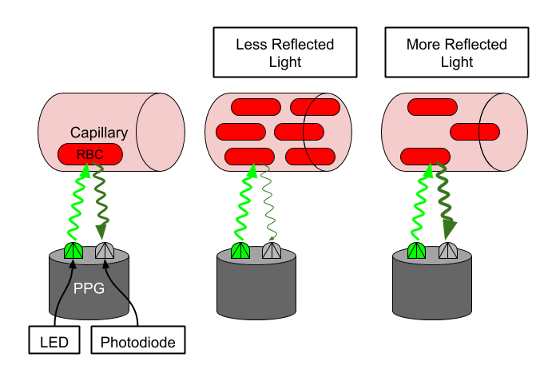

# Motion-compensated pulse rate estimation
This project has 2 main parts.

1. [Develop a Pulse Rate Algorithm](./1_pulse_rate_estimation/README.md) on the given training data.
2. [Apply the Pulse Rate Algorithm on a Clinical Application](./2_medical_application/README.md) to discover healthcare trends.

## Motivation
A core feature that many users expect from their wearable devices is pulse rate estimation. Continuous pulse rate estimation can be informative for many aspects of a wearer's health. Pulse rate during exercise can be a measure of workout intensity and resting heart rate is sometimes used as an overall measure of cardiovascular fitness. In this project you will create a pulse rate estimation algorithm for a wrist-wearable device. Use the information in the Physiological Mechanics of Pulse Rate Estimation section below to inform the design of your algorithm. Make sure that your algorithm conforms to the given Algorithm Specifications in the following concept, Part 1: Overview & Instructions.

## Background - Physiological Mechanics of Pulse Rate Estimation
Pulse rate is typically estimated by using the PPG sensor. When the ventricles contract, the capillaries in the wrist fill with blood. The (typically green) light emitted by the PPG sensor is absorbed by red blood cells in these capillaries and the photodetector will see the drop in reflected light. When the blood returns to the heart, fewer red blood cells in the wrist absorb the light and the photodetector sees an increase in reflected light. The period of this oscillating waveform is the pulse rate.

However, the heart beating is not the only phenomenon that modulates the PPG signal. Blood in the wrist is fluid, and arm movement will cause the blood to move correspondingly. During exercise, like walking or running, we see another periodic signal in the PPG due to this arm motion. Our pulse rate estimator has to be careful not to confuse this periodic signal with the pulse rate.

We can use the accelerometer signal of our wearable device to help us keep track of which periodic signal is caused by motion. Because the accelerometer is only sensing arm motion, any periodic signal in the accelerometer is likely not due to the heart beating, and only due to the arm motion. If our pulse rate estimator is picking a frequency that's strong in the accelerometer, it may be making a mistake.

All estimators will have some amount of error. How much error is tolerable depends on the application. If we were using these pulse rate estimates to compute long term trends over months, then we may be more robust to higher error variance. However, if we wanted to give information back to the user about a specific workout or night of sleep, we would require a much lower error.

## Acknowledgements
This project is part of my submission to Udacity's [AI for HealtCare](https://learn.udacity.com/nanodegrees/nd320) course.